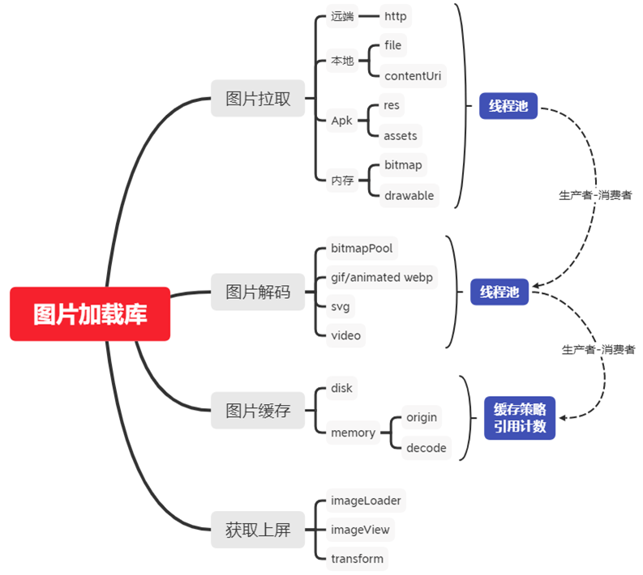
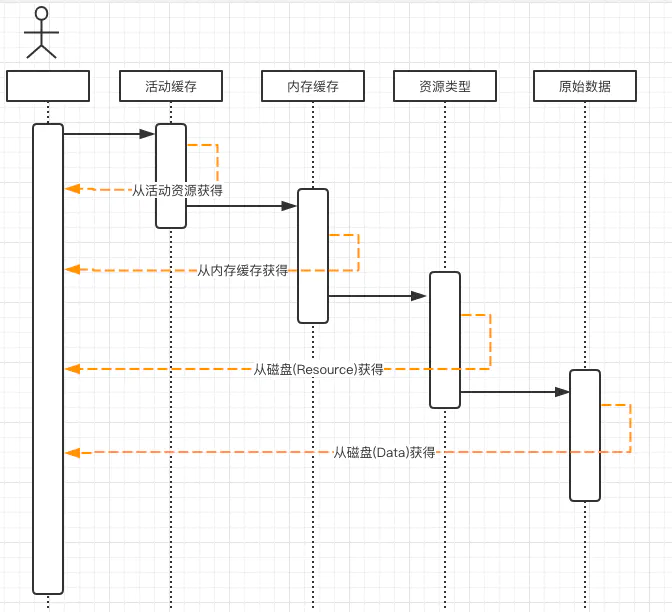
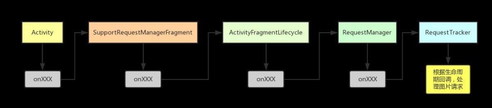

# Glide

图片加载库

# 多级缓存

- 活动缓存 active resource

    - 当需要加载某张图片能够从内存缓存中获得的时候，在图片加载时主动将对应图片从内存缓存中移除，加入到活动资源中。这样也可以避免因为达到内存缓存最大值或者系统内存压力导致的内存缓存清理，从而释放掉活动资源中的图片(recycle)。活动资源中是一个”引用计数"的图片资源的弱引用集合。因为同一张图片可能在多个地方被同时使用，每一次使用都会将引用计数+1,而当引用计数为0时候，则表示这个图片没有被使用也就是没有强引用了。这样则会将图片从活动资源中移除，并加入内存缓存。

- 内存缓存 memory cache

    - 内存缓存默认使用LRU(缓存淘汰算法/最近最少使用算法),当资源从活动资源移除的时候，会加入此缓存。使用图片的时候会主动从此缓存移除，加入活动资源。

- 资源缓存 resource disk cache

    - Resource 缓存的是经过解码后的图片，如果再使用就不需要再去进行解码配置(BitmapFactory.Options),加快获得图片速度。比如原图是一个100x100的ARGB_8888图片，在首次使用的时候需要的是50x50的RGB_565图片，那么Resource将50x50 RGB_565缓存下来，再次使用此图片的时候就可以从 Resource 获得。不需要去计算inSampleSize(缩放因子)。

- 原始缓存 data disk cache

--

# BitmapPool
bitmap复用,在未使用复用的情况下，每张图片都需要一块内存。而使用复用的时候，如果存在能被复用的图片会重复使用该图片的内存。 所以复用并不能减少程序正在使用的内存大小。Bitmap复用，解决的是减少频繁申请内存带来的性能(抖动、碎片)问题。

- bitmapfavtory.options mutable=true

- Android 4.4及以上只需要被复用的Bitmap的内存必须大于等于需要新获得Bitmap的内存，则允许复用此Bitmap。

- 4.4以下(3.0以上)则被复用的Bitmap与使用复用的Bitmap必须宽、高相等并且使用复用的Bitmap解码时设置的inSampleSize为1，才允许复用。

- groupedlinkedmap,Glide 并没有使用现成的，而是定义了一个 GroupedLinkedMap ，其类似 LinkedHashMap ，其实体 LinedEntry 可以用于实现双向链表，并通过 GroupedLinkedMap#makeTail/GroupedLinkedMap#makeHead 方法来改变链表头尾位置，使得具有 LRU 功能，且 LinedEntry 的 Value 为一个 List 集合，因为可能有多个相同 key（例如：Bitmap Size）的 Bitmap 集合可以复用，而且可以控制移除队列最后一个对象，而不是整个 List 集合，这应该是不使用 LRUCache 的原因

    - GroupedLinkedMap双向链表

    - LinedEntry的value是一个list

- lrupoolstrategy

    - sizeconfigstrategy

         - AttributeStrategy 的区别在于存储的Key值条件不一样, SizeConfigStrategy 的 Key 是 size (w*h) 和 config 组成, 之所以能这么做完全依赖于 Bitmap 的一个方法 reconfigure()

         - 只要被复用的内存比需要申请的内存小

    - sizestrategy

    - attributestratery

--

# 生命周期管理

- 基于当前activity添加无ui得fragment,通过fragment接受activity传递生命周期，fragment 和requestmanager基于lifecycle建立联系，并传递生命周期事件，实现生命周期感知

# 动态测量imageview大小

- Glide将加载图片到ImageVIew封装成Request对象，在run Request的时候进行判断，该方法首先调用View.getWidth()/View.getHeight()，如果其中一个或者两个为0，那么接着检查View's LayoutParams,那么就设置监听ViewTreeObserver.OnPreDrawListener，等待ImageView绘制前回调监听获取视图大小，在加载确定大小的图片

- 源码中如果设置wrap_content, 并且无法计算宽高时, Glide默认获取Window的宽高, 所以当我们在列表中加载图片时, 可能会加载多张原图, 这样会导致严重的oom.同时, 如果我们设置了默认图和错误图和加载的图片尺寸不一样 还会导致图片的抖动

- 当ImageView设置match_parent 但是父控件为wrap_content 时图片加载不出来问题， 当View表示它的宽高可以由其内容测量出来时, Glide仅仅会从测量完成的那个监听处获取大小, 但是因为父布局大小无法计算, 而ImageView也没有设置一个可用大小的图, 所以每次获得都是0, 这样这个请求就永远不会触发加载, 所以和上面的问题一样, 设置wrap_content时, 最坏的情况下, 也要设置一个可行大小的默认图.

