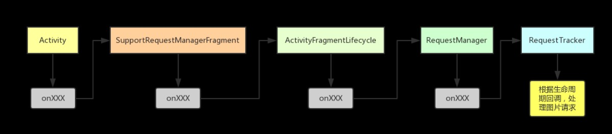

# Android 图片加载框架设计 + 超大图加载

> 以 Glide 为例，涵盖自研图片框架架构、多级缓存、BitmapPool、OOM 预防、生命周期管理，以及超大图分块加载方案。

## 目录

1. [整体知识大纲](#一整体知识大纲)
2. [图片加载框架架构设计](#二图片加载框架架构设计)
3. [多级缓存机制](#三多级缓存机制)
4. [BitmapPool 复用池](#四bitmappool-复用池)
5. [生命周期管理](#五生命周期管理)
6. [动态测量 ImageView 大小](#六动态测量-imageview-大小)
7. [OOM 完整预防机制](#七oom-完整预防机制)
8. [Glide VS Coil 核心对比](#八glide-vs-coil-核心对比)
9. [大图 / 超大图加载方案](#九大图--超大图加载方案)
10. [面试终极口述标准答案](#十面试终极口述标准答案)

---

## 一、整体知识大纲

1. 自研图片框架整体架构 & 完整加载流程
2. 三级缓存机制（内存/磁盘/网络）
3. 内存缓存淘汰策略：LRU + Glide 引用计数优化
4. Bitmap OOM 全套预防机制
5. Glide VS Coil 核心差异与选型
6. 普通大图压缩方案（inSampleSize 采样压缩）
7. **超大万像素原图浏览方案（BitmapRegionDecoder 分块加载）**

---

## 二、图片加载框架架构设计

### 1. 七层架构模块

1. **API 层**：建造者模式，配置 url、占位图、裁剪、变换、优先级
2. **请求调度层**：线程池/协程、请求去重、View 复用取消旧请求、生命周期绑定
3. **缓存层**：内存缓存、磁盘缓存、缓存 Key 生成
4. **数据层**：网络/本地文件/资源读取
5. **解码层**：采样压缩、格式选择、Bitmap 解码
6. **变换层**：圆角、圆形、模糊、裁剪
7. **渲染层**：主线程更新 ImageView、防止列表错乱

### 2. 标准加载流程

内存缓存 → 磁盘缓存 → 网络下载

1. 生成唯一缓存 Key（url+宽高+变换参数）
2. 命中内存缓存：直接显示
3. 未命中 → 读取磁盘缓存字节流
4. 磁盘命中 → 子线程解码 Bitmap、放入内存缓存、显示
5. 磁盘未命中 → 网络下载字节流
6. 下载成功 → 写入磁盘缓存、解码、放入内存、展示

> 关键：**内存缓存存解码后的 Bitmap，磁盘缓存存原始图片字节流**。

---

## 三、多级缓存机制

### 1. 活动缓存（ActiveResources）

- 当需要加载某张图片且能从内存缓存中获得的时候，在图片加载时主动将对应图片从内存缓存中移除，加入到活动资源中
- 这样可避免因为达到内存缓存最大值或系统内存压力导致的内存缓存清理，从而释放掉活动资源中的图片（recycle）
- 活动资源中是一个"引用计数"的图片资源的弱引用集合：同一张图片可能在多个地方被同时使用，每一次使用都会将引用计数 +1；当引用计数为 0 时，表示这个图片没有被使用（没有强引用了），图片会从活动资源中移除，并加入内存缓存
- **正在屏幕显示的 Bitmap 禁止 LRU 回收**，防止滑动列表闪白、重加载

### 2. 内存缓存（Memory Cache）

- 存储：解码完成的 Bitmap
- 速度：最快
- 容量：默认堆内存 1/8
- 内存缓存默认使用 LRU（缓存淘汰算法/最近最少使用算法）：当资源从活动资源移除时，加入此缓存；使用图片时会主动从此缓存移除，加入活动资源
- 页面不使用、引用计数为 0 的 Bitmap 遵循 LRU 最近最少使用淘汰策略

### 3. 资源磁盘缓存（Resource Disk Cache）

- Resource 缓存的是**经过解码后的图片**，再次使用就不需要重新进行解码配置（BitmapFactory.Options），加快获得图片速度
- 例如：原图是 100x100 的 ARGB_8888 图片，首次使用需要 50x50 的 RGB_565 图片，那么 Resource 将 50x50 RGB_565 缓存下来，再次使用此图片时可以直接从 Resource 获得，不需要重新计算 inSampleSize（缩放因子）

### 4. 原始磁盘缓存（Data Disk Cache）

- 存储：**原始图片字节流**（不解码）
- 优点：不占堆内存、APP 重启不丢失
- 淘汰：磁盘满时删除最久未使用文件（DiskLruCache）

### 5. 网络缓存

磁盘未命中才触发网络请求，下载后双写缓存（内存+磁盘）

---

## 四、BitmapPool 复用池

Bitmap 复用：在未使用复用的情况下，每张图片都需要一块内存；使用复用时，如果存在能被复用的图片会重复使用该图片的内存。**复用并不能减少程序正在使用的内存大小，解决的是减少频繁申请内存带来的性能（抖动、碎片）问题。**

- `BitmapFactory.Options.inMutable = true`：Android 4.4 及以上只需要被复用的 Bitmap 的内存 ≥ 需要新获得 Bitmap 的内存，即允许复用；4.4 以下（3.0 以上）则要求被复用的 Bitmap 与使用复用的 Bitmap 宽、高相等，且解码时设置的 inSampleSize 为 1，才允许复用
- **GroupedLinkedMap**：Glide 并没有使用现成的 LRUCache，而是自定义了 GroupedLinkedMap，类似 LinkedHashMap。其实体 LinkedEntry 用于实现双向链表，通过 `GroupedLinkedMap#makeTail/makeHead` 改变链表头尾位置，实现 LRU 功能。LinkedEntry 的 Value 是一个 List 集合——因为可能有多个相同 key（例如 Bitmap Size）的 Bitmap 集合可以复用，而且可以控制只移除队列最后一个对象，而不是整个 List 集合，这应该是不使用 LRUCache 的原因
  - GroupedLinkedMap：双向链表
  - LinkedEntry 的 value 是一个 list
- **LruPoolStrategy**
  - **SizeConfigStrategy**：与 AttributeStrategy 的区别在于存储的 Key 条件不一样。SizeConfigStrategy 的 Key 由 size（w*h）和 config 组成，之所以能这么做完全依赖于 Bitmap 的 `reconfigure()` 方法——只要被复用的内存 ≥ 需要申请的内存即可复用
  - **AttributeStrategy**：要求宽高、config 完全一致才复用

---

## 五、生命周期管理

- 基于当前 Activity 添加无 UI 的 Fragment，通过 Fragment 接收 Activity 传递的生命周期
- Fragment 和 RequestManager 基于 Lifecycle 建立联系，并传递生命周期事件，实现生命周期感知
- 页面销毁自动终止解码/网络请求，避免无效 Bitmap 加载

---

## 六、动态测量 ImageView 大小

- Glide 将加载图片到 ImageView 封装成 Request 对象，在 run Request 时进行判断：首先调用 `View.getWidth()/View.getHeight()`，如果其中一个或两个为 0，则接着检查 View 的 LayoutParams，然后设置监听 `ViewTreeObserver.OnPreDrawListener`，等待 ImageView 绘制前回调获取视图大小，再加载确定大小的图片
- 源码中如果设置 `wrap_content` 且无法计算宽高时，Glide 默认获取 Window 的宽高。所以当在列表中加载图片时，可能会加载多张原图，导致严重的 OOM；同时，如果设置的默认图、错误图与加载的图片尺寸不一样，还会导致图片的抖动
- 当 ImageView 设置 `match_parent` 但父控件为 `wrap_content` 时图片加载不出来：当 View 表示它的宽高可以由其内容测量出来时，Glide 仅仅会从测量完成的那个监听处获取大小；因为父布局大小无法计算，而 ImageView 也没有设置一个可用大小的图，所以每次获得的都是 0，这个请求就永远不会触发加载。所以设置 `wrap_content` 时，最坏的情况下也要设置一个可行大小的默认图

---

## 七、OOM 完整预防机制

1. **inSampleSize 动态采样压缩**：根据 ImageView 控件尺寸，动态缩小图片分辨率，降低像素内存占用
2. **像素格式优化**：无透明图使用 `RGB_565`（2 字节/像素），相比 ARGB8888 内存减半
3. **BitmapPool 复用池**：复用旧 Bitmap 内存空间，减少频繁创建销毁，**解决内存抖动**
4. **引用计数内存管理**：正在使用的 Bitmap 不回收，闲置 Bitmap 及时 LRU 淘汰
5. **生命周期自动取消请求**：页面销毁自动终止解码/网络请求，避免无效 Bitmap 加载
6. **手动及时 recycle**：页面关闭、图片替换时释放 Native 内存
7. **捕获 OOM 异常降级处理**

---

## 八、Glide VS Coil 核心对比

### 1. Glide（成熟稳定、大厂首选）

- 语言：Java、线程池调度
- 内存模型：ActiveResources + LRU 双重缓存（更稳）
- 能力：GIF 完美支持、预加载、缩略图、变换强大
- 优点：内存管控极致、滑动体验极佳、无闪图

### 2. Coil（Kotlin 现代首选）

- 语言：纯 Kotlin、协程实现
- 调度：结构化并发，页面销毁自动 cancel
- 缺点：无 ActiveResources，单纯 LRU，内存紧张会回收正在显示的图
- 优势：轻量、简洁、适配 Compose、挂起函数优雅

### 3. 项目选型

- 老项目、复杂列表、需要极致稳定性 → **Glide**
- Kotlin 新项目、Compose、追求简洁架构 → **Coil**

---

## 九、大图 / 超大图加载方案

### 场景 1：普通大图、仅需缩略展示

**方案：inSampleSize 全局采样压缩**

1. `inJustDecodeBounds=true` 只读取图片宽高，不占用内存
2. 根据控件大小计算采样率
3. 整体缩小解码一张完整 Bitmap

**缺点**：只能缩小，**无法查看高清原图细节**，放大模糊

### 场景 2：上万像素超大图（长图/海报/高清原图）

**方案：BitmapRegionDecoder 分块局部加载（唯一解）**

#### 核心原理

**不解码整张图片，只解码屏幕可视区域**

1. 大图保存在磁盘，不一次性载入内存
2. 根据手势滚动/缩放，实时计算当前可视 Rect 区域
3. 只解码当前可视一小块 Bitmap 绘制
4. 不断回收旧区块，内存永远只保留屏幕可见内容

#### 适用场景

- 千万像素海报、长截图、地图大图、高清查看器
- 支持手势缩放、查看原图细节

#### 限制

- 只支持本地文件，**网络大图必须先下载落本地**
- 必须子线程解码、手动 recycle 防 Native 内存泄漏

---

## 十、面试终极口述标准答案

### 1. 图片加载框架原理

图片加载采用 **三级缓存架构**：内存缓存存放已解码 Bitmap，通过 Glide 引用计数+LRU 管控，保证滑动稳定性；磁盘缓存存放原始字节流，持久化缓存；未命中则网络下载。
通过动态采样压缩、RGB565、Bitmap 复用池、生命周期取消请求全方位预防 OOM。

### 2. 超大图如何加载

普通大图使用 inSampleSize 采样压缩缩略展示；
**万像素超大原图**不能整体加载，会直接 OOM，必须使用 **BitmapRegionDecoder 分块加载**，只解码屏幕可视区域，按需局部解码，实现高清大图无 OOM 浏览。

### 3. Glide 优势

区别于普通 LruCache，Glide 拥有 **ActiveResources 引用计数机制**，保护正在展示的 Bitmap 不被回收，解决列表滑动闪图、重复加载问题，内存管控更优秀。
